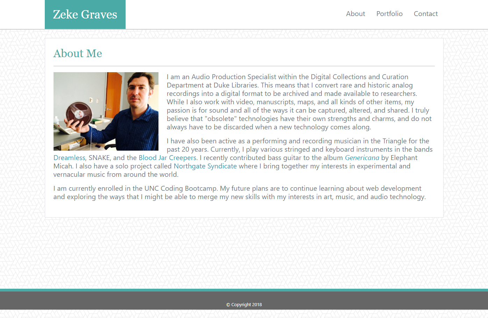
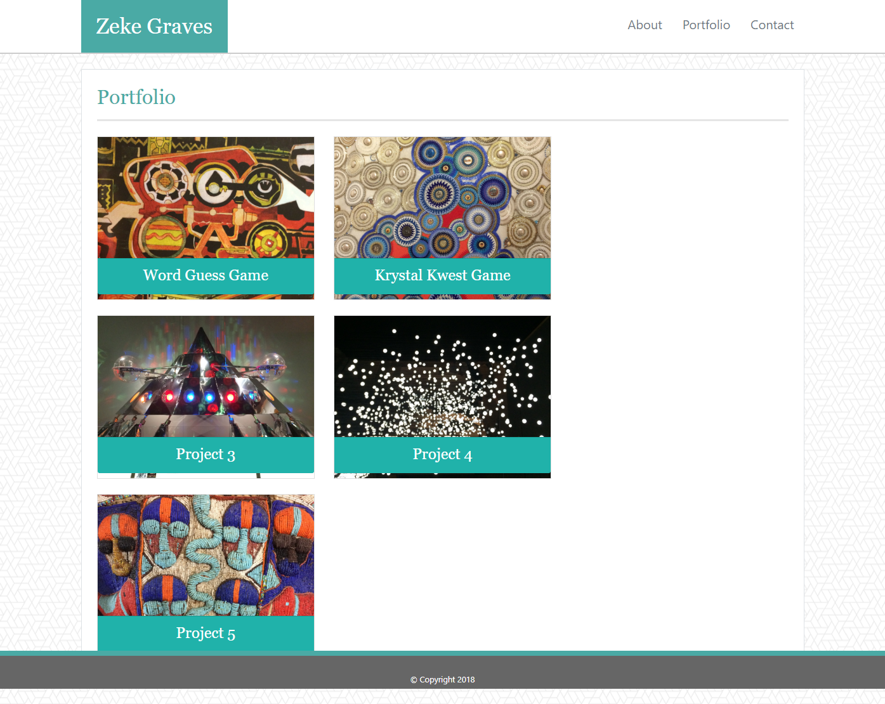
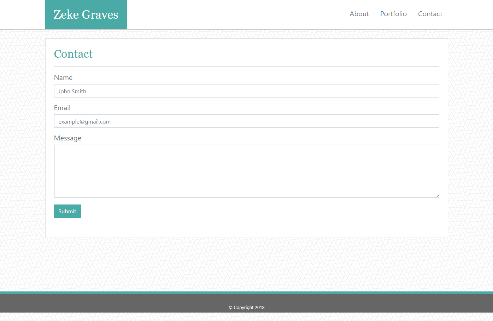
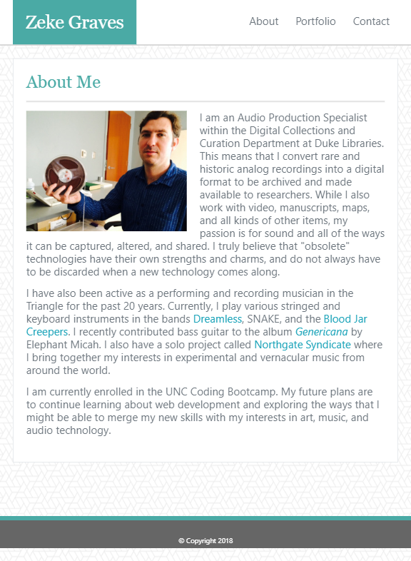
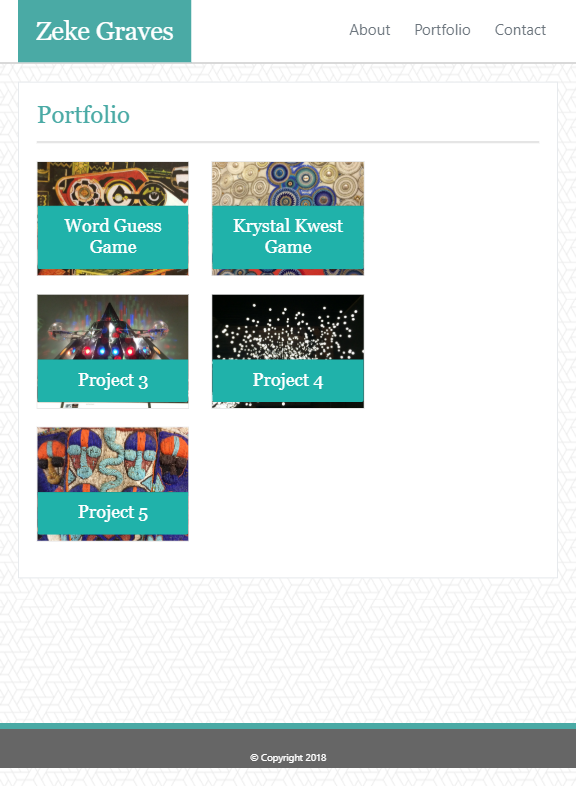
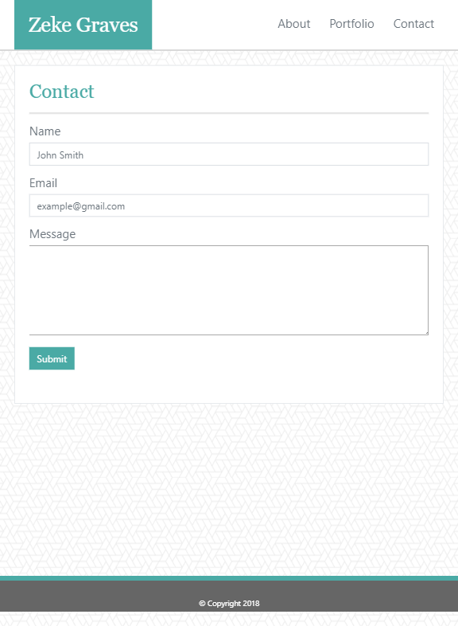
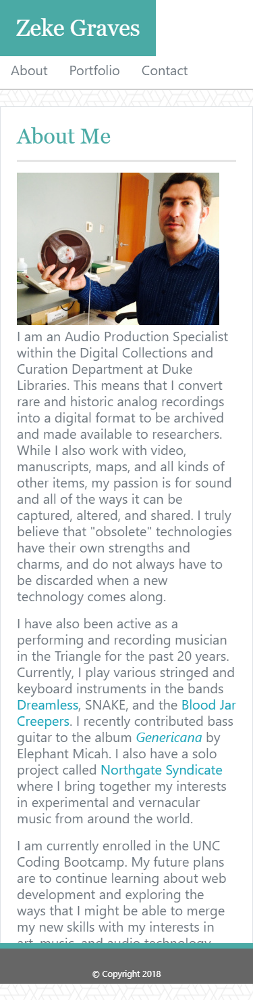
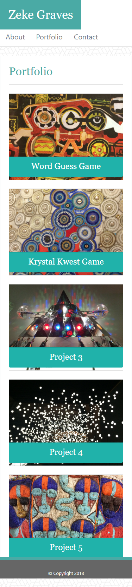
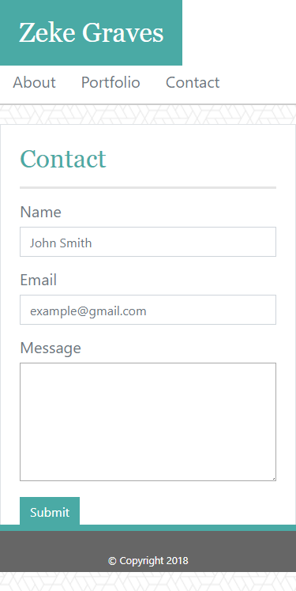

# Bootstrap-Portfolio
## UNC Coding Bootcamp Homework #2  9-13-2018

This assignment required building a responsive website with Bio, Portfolio, and Contact pages based on templates given only as jpeg images. 

It demonstrates an understanding of how to use a CSS framework with HTML to create a website that is responsive accross different viewports.

My deployed app can be viewed here: https://zinc-glaze.github.io/Bootstrap-Portfolio/

### Screenshots

